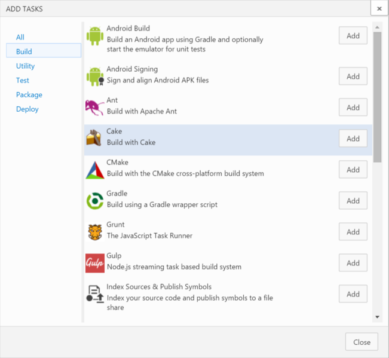
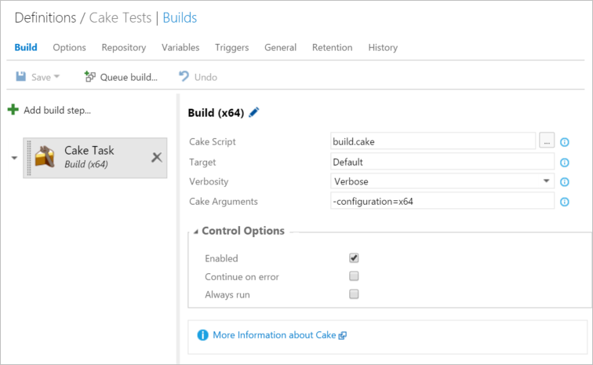
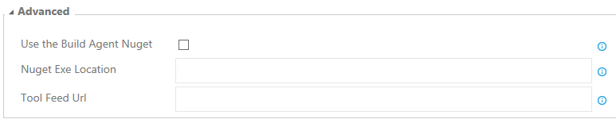

Cake
====

This extension contains a custom build task that runs Cake build scripts for you.

Cake (C# Make) is a cross platform build automation system with a C# DSL to do things like compiling code, copy files/folders, running unit tests, compress files and build NuGet packages.

Run Cake scripts easily
-----------------------

The Cake VSO build tasks makes it easy to run a Cake script directly without having to invoke PowerShell or other commands line scripts. This makes it easy even for team members not familiar with Cake to add or adjust parameters passed to your build scripts.

How to use the build task
-------------------------

After installing this extension, a new task will become available called "Cake Task" when you add a new build step for a build definition.

By default, the Cake build step (when added to a build) will try to run the `build.cake` build script (found in the root of your repository) with the target `Default`. If you wish to run another build script or build target you can change this in the build step settings.

At the moment, only Windows build agents are supported, but we expect to add support for other build agents soon.

Advanced Settings
----------
There are several advanced settings that control where the Cake build step downloads tools from.

### Use the Build Agent Nuget 
This will use the version of `nuget.exe` shipped with the build agent `<AgentInstallFolder>\agent\Worker\Tools\Nuget.exe` if set. This is set to False by default.

### Nuget Exe Location 
If not using the Build Agent copy of `nuget.exe` this setting specifies where to download the executable from. This can be a URL e.g. `https://nuget.org/nuget.exe` or a simple folder path such as `D:\Tools\Nuget.exe`. If nothing is set the task will download `nuget.exe` from `https://dist.nuget.org/win-x86-commandline/latest/nuget.exe`  

### Tool Feed URL
The `cake.exe`, `#addin` and `#tool` packages are by default downloaded from the default nuget.org package feed. You can download these tools from an alternate feed by specifiying it here.

Learn more
----------

For more information about Cake, please see the [Cake website](http://cakebuild.net) or the Cake [source code repository](https://github.com/cake-build/cake).
